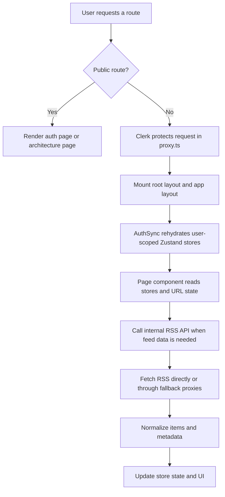
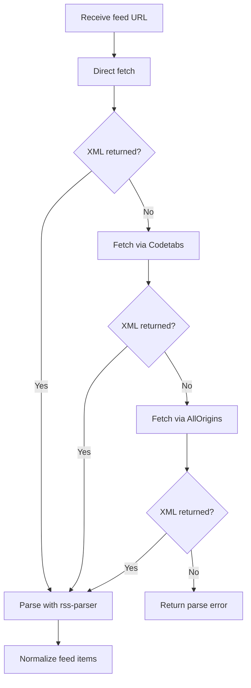

# RSS Studio

RSS Studio is a mobile-friendly RSS reader built with Next.js. It helps people discover feeds, subscribe to sources, organize them into folders, read articles in a focused layout, and save bookmarks for later.

## Stack

- Next.js 16 App Router
- React 19
- TypeScript
- Tailwind CSS v4
- Clerk for authentication
- Zustand for client state and persistence
- `rss-parser` for RSS and Atom normalization

## Local Setup

### Prerequisites

- Node.js 20+
- npm
- A Clerk app with local development keys

### Environment

Copy `example.env` to `.env.local` and fill in your real Clerk values:

```bash
cp example.env .env.local
```

```bash
NEXT_PUBLIC_CLERK_SIGN_IN_URL=/sign-in
NEXT_PUBLIC_CLERK_SIGN_UP_URL=/sign-up
NEXT_PUBLIC_CLERK_SIGN_IN_FALLBACK_REDIRECT_URL=/
NEXT_PUBLIC_CLERK_SIGN_UP_FALLBACK_REDIRECT_URL=/
NEXT_PUBLIC_CLERK_PUBLISHABLE_KEY=<secret-value>
CLERK_SECRET_KEY=<secret-value>
```

### Install And Run

```bash
npm install
npm run dev
```

Open [http://localhost:3000](http://localhost:3000).

### Useful Commands

```bash
npm run dev
npm run build
npm run start
npm run lint
```

## Route Map

### Product routes

- `/` Today page with `me` and `explore` tabs
- `/search` discover RSS feeds from a URL or curated categories
- `/sources` manage followed sources
- `/feeds` browse a selected source feed
- `/bookmarks` revisit saved articles
- `/settings` change theme, reading size, and feed layout
- `/article/[id]` focused reading view for the selected article

### Public routes

- `/sign-in` and `/sign-up`
- `/architecture`

### Metadata routes

- `/robots.txt`
- `/llms.txt`

### Internal RSS APIs

- `POST /api/rss/search`
- `POST /api/rss/parse`
- `GET /api/rss/explore`

## Architecture Overview

RSS Studio uses route groups to separate authentication from the protected application shell:

- `src/app/(auth)` renders Clerk sign-in and sign-up flows
- `src/app/(app)` renders the authenticated reading experience
- `src/app/api/rss/*` contains the server routes that search, parse, and aggregate feeds
- `src/proxy.ts` protects non-public routes with Clerk

Core moving pieces:

- `ClerkProvider` is mounted in the root layout
- `AuthSync` migrates old storage keys, sets the active user id, and rehydrates persisted stores
- `AppShell` renders the shared sidebar, mobile nav, and toast container
- Zustand stores own user data, runtime feed caches, and reading preferences
- RSS route handlers normalize third-party feeds into a consistent `FeedItem` shape

### State model

- `feed-store` owns sources, folders, Today feed data, Explore data, source-level caches, selected source, and selected article
- `bookmark-store` owns saved article snapshots
- `settings-store` owns theme, reading font size, and feed view mode
- `toast-store` owns short-lived in-memory notifications

Only the durable user state is persisted. Feed result lists, loading flags, and source cache timestamps stay in memory.

### Request and data flow



## RSS Discovery And Parsing

RSS Studio combines user-supplied feeds with curated catalogs.

### Search sources

- URL-like queries are treated as feed discovery attempts
- keyword queries search the curated catalog in `src/lib/discover-sources.ts`
- curated categories are grouped into `Popular Topics`, `Industries`, `Skills`, and `Fun`

### Explore sources

`GET /api/rss/explore` fetches a smaller hand-picked set from `src/lib/constants.ts`:

- BBC News
- Hacker News
- TechCrunch
- The Verge
- Ars Technica
- NPR News

### Parse strategy

`POST /api/rss/parse` tries to retrieve valid XML in stages:

1. Direct fetch with browser-like headers
2. `api.codetabs.com` proxy fallback
3. `api.allorigins.win` proxy fallback

The parser is configured to read custom fields such as `media:content`, `media:thumbnail`, and `content:encoded`, then normalize each item into the app model with title, link, description, content, image, author, publish date, and source metadata.



## Project Structure

```text
src/
├─ app/
│  ├─ layout.tsx
│  ├─ globals.css
│  ├─ robots.ts
│  ├─ llms.txt/route.ts
│  ├─ architecture/page.tsx
│  ├─ (auth)/
│  │  ├─ layout.tsx
│  │  ├─ sign-in/[[...sign-in]]/page.tsx
│  │  └─ sign-up/[[...sign-up]]/page.tsx
│  ├─ (app)/
│  │  ├─ layout.tsx
│  │  ├─ page.tsx
│  │  ├─ search/page.tsx
│  │  ├─ sources/page.tsx
│  │  ├─ feeds/page.tsx
│  │  ├─ bookmarks/page.tsx
│  │  ├─ settings/page.tsx
│  │  └─ article/[id]/page.tsx
│  └─ api/rss/
│     ├─ search/route.ts
│     ├─ parse/route.ts
│     └─ explore/route.ts
├─ components/
│  ├─ layout/
│  ├─ pages/
│  │  ├─ article/
│  │  ├─ feeds/
│  │  ├─ search/
│  │  ├─ settings/
│  │  ├─ sources/
│  │  └─ today/
│  ├─ feed/
│  ├─ feeds/
│  ├─ sources/
│  └─ ui/
├─ hooks/
│  ├─ pages/
│  │  ├─ article/
│  │  ├─ feeds/
│  │  ├─ search/
│  │  └─ today/
│  └─ use-article-transition.ts
├─ lib/
├─ stores/
└─ proxy.ts
```

### Key folders outside `src`

```text
public/
prompts/
example.env
next.config.ts
eslint.config.mjs
```

## Notes

- Protected product routes are enforced in `src/proxy.ts`
- Persisted state is namespaced per Clerk user in `localStorage`
- The article page depends on `selectedArticle` from `feed-store`, so direct refreshes fall back to an article-not-found state
- `/architecture` is the best place to see the current structure and feature flows in a browser-friendly format

