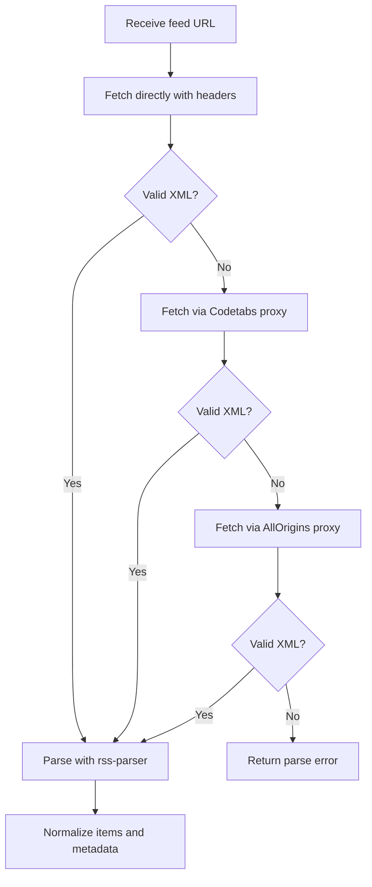

# RSS Studio

RSS Studio is a mobile-friendly RSS reader built with Next.js. It lets users discover RSS feeds, subscribe to sources, organize them into folders, read articles, and save bookmarks.

## Run The Project

### Prerequisites

- Node.js 20+
- npm
- Clerk environment variables configured

### Environment

Create `.env.local` and add the required Clerk public variables:

```bash
NEXT_PUBLIC_CLERK_SIGN_IN_URL=/sign-in
NEXT_PUBLIC_CLERK_SIGN_UP_URL=/sign-up
NEXT_PUBLIC_CLERK_SIGN_IN_FALLBACK_REDIRECT_URL=/
NEXT_PUBLIC_CLERK_SIGN_UP_FALLBACK_REDIRECT_URL=/
NEXT_PUBLIC_CLERK_PUBLISHABLE_KEY=<secret-value>
CLERK_SECRET_KEY=<secret-value>
```

Add the rest of your Clerk keys in local environment files as needed.

### Install And Start

```bash
npm install
npm run dev
```

Open [http://localhost:3000](http://localhost:3000).

### Useful Commands

```bash
npm run dev
npm run build
npm run start
npm run lint
```

## Project Architecture

RSS Studio uses the Next.js App Router with route groups:

- `(auth)` for sign-in and sign-up pages
- `(app)` for authenticated application pages
- `api/rss/*` for RSS search, parse, and explore endpoints
- `/architecture` for the public architecture documentation page

Core architectural pieces:

- `Clerk` handles authentication and route protection
- `Zustand` manages feeds, bookmarks, settings, and toast state
- `zustand/persist` stores selected state in user-scoped `localStorage`
- `AuthSync` rehydrates persisted state when the active user changes
- RSS route handlers normalize external feed data into app-friendly models

Main state areas:

- `feed-store` manages subscriptions, folders, selected article, and feed fetching
- `bookmark-store` manages saved articles
- `settings-store` manages theme, reading preferences, and feed layout
- `toast-store` manages transient notifications

## RSS Discovery And Sources

RSS Studio uses both user-provided feeds and curated static sources.

### User-provided sources

- users can paste a direct RSS URL
- users can paste a website URL and the app will try to discover common feed endpoints such as `/feed`, `/rss`, `/rss.xml`, `/feed.xml`, `/atom.xml`, and `/index.xml`
- subscribed sources are stored in `feed-store` and fetched through `POST /api/rss/parse`

### Curated search sources

Keyword search is backed by a static catalog in `src/lib/discover-sources.ts`.

This catalog is grouped into sections and categories such as:

- `Popular Topics`: Tech, Cyber Security, Business, News
- `Industries`: Advertising, Automotive, Healthcare, Financial Services, Energy, Real Estate, Retail
- `Skills`: Programming, Data Science, Entrepreneurship, Leadership, SEO, Design, Photography, Writing
- `Fun`: Comics, Gaming, Food, Travel, Music, Culture, Science, Sports

The catalog contains predefined RSS sources such as:

- The Verge
- TechCrunch
- Ars Technica
- Wired
- BBC News
- NPR News
- Reuters
- Hacker News
- Martin Fowler
- xkcd
- NASA
- ESPN

When a search query is not a direct URL, `POST /api/rss/search` matches the query against category names and source metadata from this static catalog and returns matching categories and sources.

### Curated explore sources

The Explore feed is powered by a smaller static list in `src/lib/constants.ts`:

- BBC News
- Hacker News
- TechCrunch
- The Verge
- Ars Technica
- NPR News

`GET /api/rss/explore` fetches these feeds, normalizes their items, sorts them by publish date, and returns the newest combined results.

## RSS Parse Mechanism

The RSS parsing flow is one of the more important parts of the app because it has to deal with inconsistent feed formats, missing metadata, and feeds that block normal server requests.

### Parser setup

The app uses `rss-parser` and extends it with custom fields so it can extract richer content:

- `media:content`
- `media:thumbnail`
- `content:encoded`

This allows the parser to work with feeds that embed images or full article HTML in non-default fields.

### Fetch strategy

`POST /api/rss/parse` receives a feed URL and tries to retrieve valid XML using a staged fallback strategy:

1. Direct fetch with browser-like headers and redirect support
2. Proxy fetch through `api.codetabs.com`
3. Proxy fetch through `api.allorigins.win`

Each request uses a timeout via `AbortSignal.timeout(...)`. The route also checks that the response actually looks like XML before trying to parse it.

This fallback chain is important because many feeds:

- block automated requests
- sit behind Cloudflare or similar protection
- redirect to HTML pages instead of XML
- expose XML only through alternate feed endpoints

### Parse flowchart




### Feed normalization

After valid XML is retrieved, the route parses the feed and converts every item into a consistent internal shape.

Each normalized item includes:

- stable generated `id`
- `title`
- `link`
- `description`
- `content`
- `imageUrl`
- `author`
- `pubDate`
- `sourceName`
- `sourceUrl`
- `sourceId`

### Content and snippet handling

- full article HTML is read from `content:encoded` when available
- otherwise it falls back to `item.content`
- the shorter preview text comes from `contentSnippet`
- if no snippet exists, HTML is stripped and the content is truncated for preview use

### Image extraction

The parser attempts image extraction in this order:

1. enclosure URL
2. `media:thumbnail`
3. `media:content`
4. first image found inside the HTML body

This allows the UI to show thumbnails even when feeds use different RSS or Atom conventions.

### Search parsing

The search route uses a lighter version of the same parsing logic:

- if the query looks like a URL, it first tries that URL directly as a feed
- if that fails, it tries common feed paths on the same origin
- once a feed is discovered, it parses the feed and returns basic feed metadata plus up to 5 preview items

### Explore parsing

The explore route reuses the same core parsing ideas for a static set of sources:

- fetch all curated explore feeds in parallel
- parse each feed independently
- keep successful results even if some feeds fail
- normalize and merge all items
- sort by `pubDate`
- return the latest combined set

### Why this is more complex than a normal fetch

RSS feeds are not uniform. Different publishers expose different fields, different content formats, and different network restrictions. The parse route exists to hide that variability from the UI and return a predictable feed model that the rest of the app can safely render.

## Folder Structure

```text
src/
├─ app/
│  ├─ layout.tsx
│  ├─ architecture/page.tsx
│  ├─ (auth)/
│  │  ├─ layout.tsx
│  │  ├─ sign-in/[[...sign-in]]/page.tsx
│  │  └─ sign-up/[[...sign-up]]/page.tsx
│  ├─ (app)/
│  │  ├─ layout.tsx
│  │  ├─ page.tsx
│  │  ├─ search/page.tsx
│  │  ├─ sources/page.tsx
│  │  ├─ feeds/page.tsx
│  │  ├─ bookmarks/page.tsx
│  │  ├─ settings/page.tsx
│  │  └─ article/[id]/page.tsx
│  └─ api/rss/
│     ├─ search/route.ts
│     ├─ parse/route.ts
│     └─ explore/route.ts
├─ components/
│  ├─ layout/
│  ├─ feed/
│  ├─ sources/
│  └─ ui/
├─ stores/
├─ hooks/
├─ lib/
└─ proxy.ts
```

Other important project folders:

```text
prompts/
├─ 01 - Start.md
├─ 02 - Refator Functionality Feeds.md
├─ 03 - Today-Me Logic Refactor.md
├─ 04 - Ability To Delete Feeds Folder.md
└─ 05 - Add Authentication Using Clerk.md

.claude/skills/
├─ frontend-patterns/SKILL.md
├─ tailwind-design-system/SKILL.md
└─ web-animation-design/SKILL.md
```

Direct links:

- Prompts
  - `[prompts/01 - Start.md](prompts/01 - Start.md)`
  - `[prompts/02 - Refator Functionality Feeds.md](prompts/02 - Refator Functionality Feeds.md)`
  - `[prompts/03 - Today-Me Logic Refactor.md](prompts/03 - Today-Me Logic Refactor.md)`
  - `[prompts/04 - Ability To Delete Feeds Folder.md](prompts/04 - Ability To Delete Feeds Folder.md)`
  - `[prompts/05 - Add Authentication Using Clerk.md](prompts/05 - Add Authentication Using Clerk.md)`
- Skills
  - `[frontend-patterns](.claude/skills/frontend-patterns/SKILL.md)`
  - `[tailwind-design-system](.claude/skills/tailwind-design-system/SKILL.md)`
  - `[web-animation-design](.claude/skills/web-animation-design/SKILL.md)`

## AI Usage

This repository includes prompt files and reusable skill documents to guide AI-assisted development.

### Prompts

The `[prompts/](prompts/)` folder contains task-specific briefs used to plan or implement larger features. Each prompt describes a focused piece of work, such as authentication, feed refactors, or folder management.

Typical usage:

- pick the prompt that matches the feature or refactor you want to work on
- use it as the implementation brief for an AI assistant or as a structured task note for manual development
- update code based on that prompt while keeping the repository architecture and rules consistent

### Skills

The `[.claude/skills/](.claude/skills/)` folder contains reusable guidance documents for common development patterns:

- `[frontend-patterns](.claude/skills/frontend-patterns/SKILL.md)` for React and Next.js architecture and UI implementation
- `[tailwind-design-system](.claude/skills/tailwind-design-system/SKILL.md)` for styling patterns, tokens, and component consistency
- `[web-animation-design](.claude/skills/web-animation-design/SKILL.md)` for animation, motion, and transition decisions

Typical usage:

- load the relevant skill before starting a UI or architecture task
- follow the skill guidance while implementing the feature
- combine a task prompt from `[prompts/](prompts/)` with one or more skills from `[.claude/skills/](.claude/skills/)` when working on larger changes

In practice, prompts define **what** to build, while skills guide **how** to build it consistently.

## Notes

- App routes are protected through Clerk middleware, except public auth routes and `/architecture`.
- Feed data is fetched from external RSS feeds and normalized on the server.
- User-specific persisted state is namespaced in browser storage so multiple signed-in users on the same device do not share app data.

